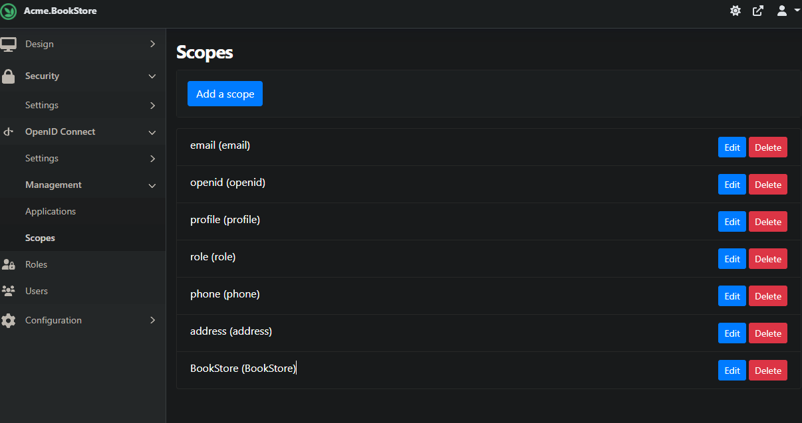
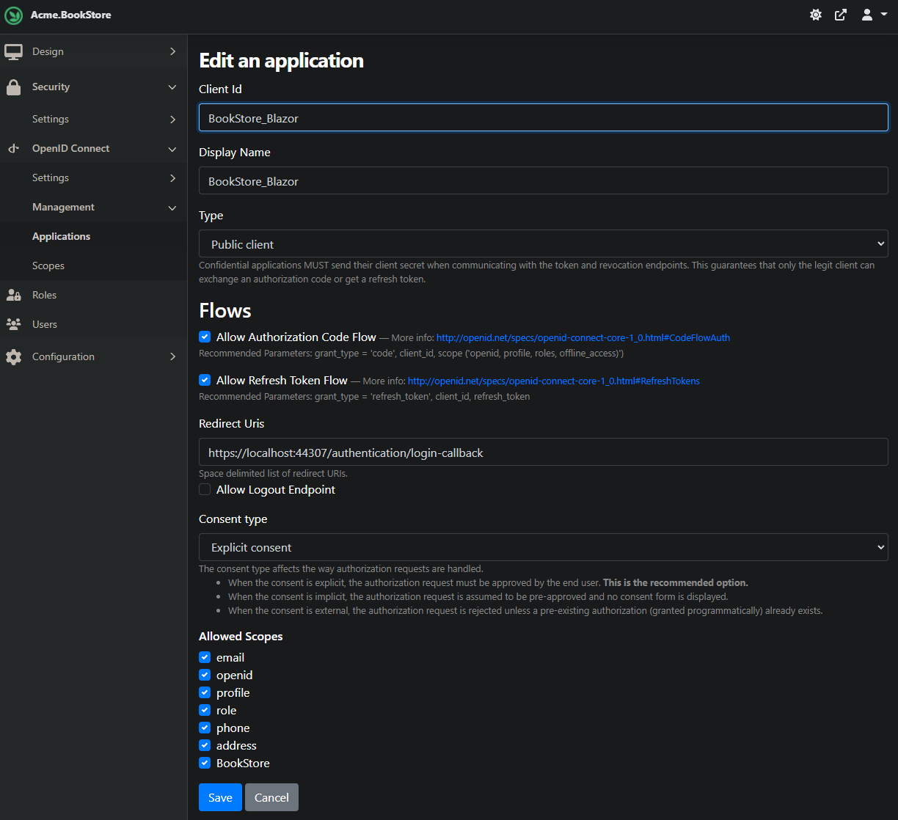

# ABP-blazor-with-Orchard-backend
A demonstration for ABP Blazor wasm authentication via using OpenIdDict which is implemented by Orchard.


## Getting Started

1. Run `orchard/Acme.BookStore/Acme.BookStore.csproj`
2. Navigate to [localhost:5001](https://localhost:5001) and configure the application. _(connection string, super user etc.)_
3. Navigate to `/Admin` path and log in with super user that you've configured before
4. Go to `Features` page from menu and activate all **OpenId** features. _(you can search for 'OpenId' in the page. Because the list is long)_
5. Then refresh page you'll see **OpenID Connect** menu under **Security**. Navigate to `Scopes` menu and add following scopes: `email`, `openid`, `profile`, `role`, `phone`, `address`, `BookStore`.
   
6. Navigate to `Applications` and create an application for `BookStore_Blazor`. _Make sure your parameters must match with following parameters_
   
7. Go to `abp/src/Acme.BookStore.Blazor/wwwroot/appsettings.json` file and configure `AuthServer` section like below 
    ```json
    "AuthServer": {
        "Authority": "https://localhost:5001",
        "ClientId": "BookStore_Blazor",
        "ResponseType": "code"
    },
    ```
8. Run both `abp/src/Acme.BookStore.Blazor/Acme.BookStore.Blazor.csproj` and `abp/src/Acme.BookStore.HttpApi.Host/Acme.BookStore.HttpApi.Host.csproj`.
9. Navigate to [localhost:44307](https://localhost:44307) and try to log in.